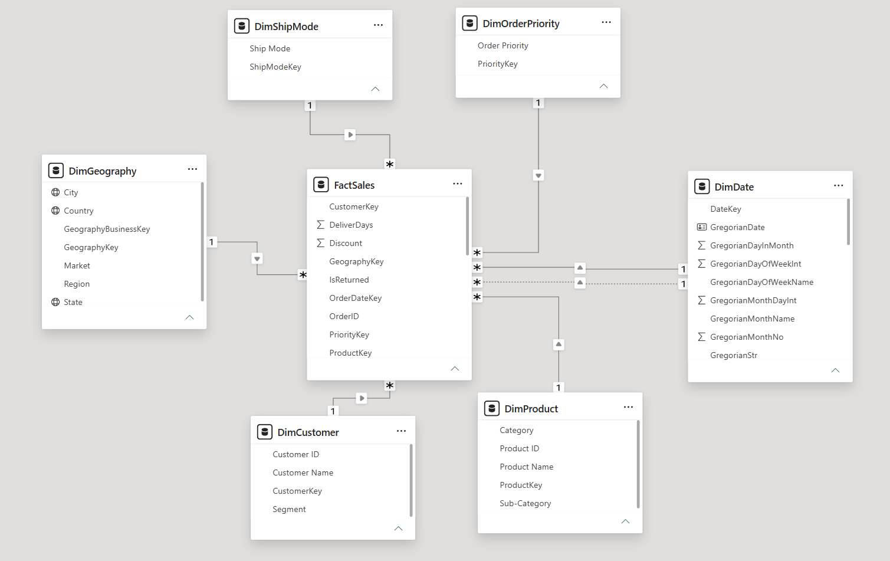
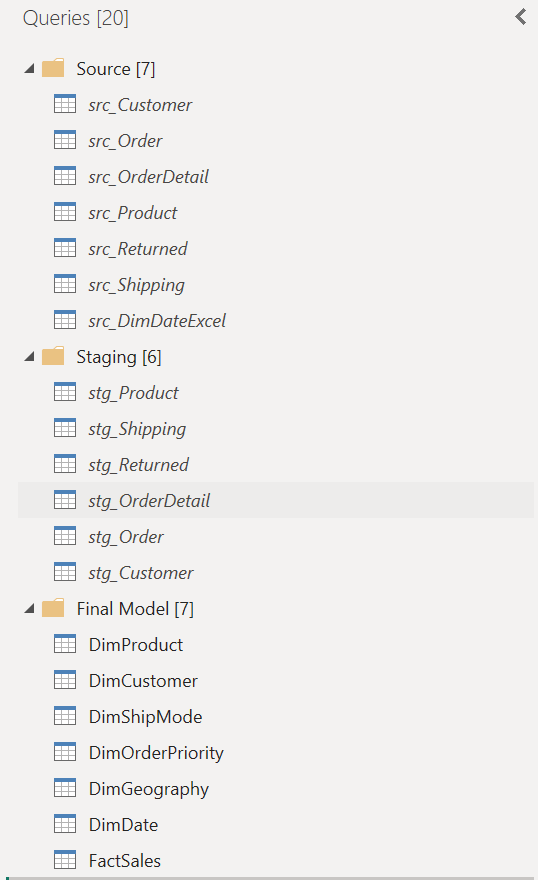
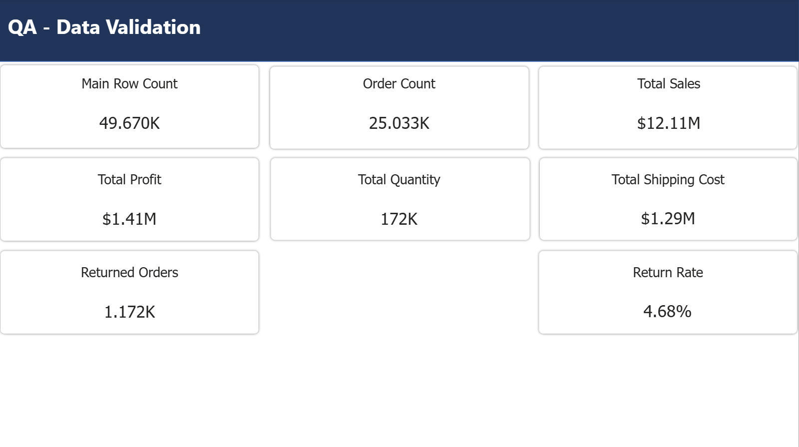

# Superstore Final Project – Phase 1

## Overview

This folder contains Phase 1 of our Superstore final project.

The main goal of this phase was to prepare the raw data and build a clean data model for the next parts of the project. We imported the original Superstore database into MySQL, connected it to Power BI, cleaned the data, and created a star schema.

Most of the data preparation was done in Power Query. We checked data types, empty values, duplicate keys, and the connections between the source tables. We also used separate source and staging queries to keep the steps organized.

## Tools We Used

- MySQL Server
- DataGrip
- Power BI Desktop
- Power Query
- DAX
- Python
- Microsoft Excel
- GitHub

## Work Completed

- Imported the original Superstore SQL database into MySQL.
- Connected Power BI to the MySQL database.
- Cleaned and checked the source tables in Power Query.
- Created separate source and staging layers.
- Built one fact table and six dimension tables.
- Added numeric keys and created the table relationships.
- Added Gregorian and Persian calendar information.
- Created QA measures to check the final row counts and totals.
- Exported the final Power BI tables to CSV.
- Created a Python script that generates a complete MySQL data warehouse file from the CSV exports.

## Final Data Model

The final model follows a star schema and contains one fact table:

- `FactSales`

It also contains six dimension tables:

- `DimProduct`
- `DimCustomer`
- `DimGeography`
- `DimShipMode`
- `DimOrderPriority`
- `DimDate`

`FactSales` contains **49,670 rows**. Each row represents one product line in an order.

## Generating the Data Warehouse File

The final Power BI tables are stored as CSV files in `data/csv`. The Python script reads these files, checks their structure and keys, and creates a self-contained MySQL file.

The script only uses Python's standard library, so no extra Python packages are needed.

From the `Phase 1` folder, run:

```bash
python scripts/generate_datawarehouse.py
```

On Windows, this command can also be used:

```bat
py scripts\generate_datawarehouse.py
```

The generated file will be saved here:

```text
sql/Superstore_DataWarehouse.sql
```

Running this SQL file creates the `superstore_dw` database, all seven tables, their relationships, and all records. The CSV files do not need to be imported manually.

## Validation Results

| Check | Result |
|---|---:|
| Fact rows | 49,670 |
| Distinct orders | 25,033 |
| Total sales | 12,111,550.4510 |
| Total profit | 1,410,243.7550 |
| Total quantity | 172,394 |
| Returned orders | 1,172 |
| Return rate | 4.68% |
| Date range | 2011-01-01 to 2015-01-07 |

## Folder Contents

- `powerbi` contains the final Power BI file.
- `sql` contains the original source SQL file and the generated data warehouse file.
- `scripts` contains the Python SQL generator.
- `data/csv` contains the seven final tables exported from Power BI.
- `data` also contains the Excel date file used in the project.
- `docs` contains screenshots of the data model, Power Query layers, and QA results.

## Project Screenshots

### Data Model



### Power Query Structure



### QA Results



## Phase 1 Status

Phase 1 is complete. The data is cleaned, checked, and ready for the next phases of the project.
